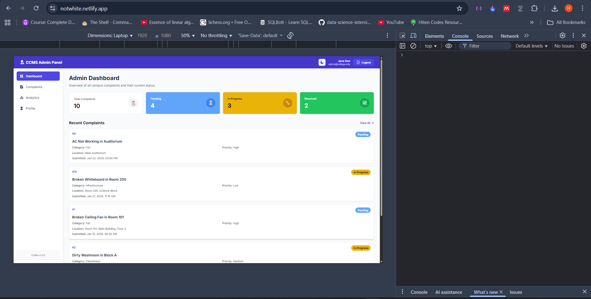

# 🎓 CCMS - Campus Complaint Management System

> Report it. Track it. Fix it. 🚀

Modern web application for managing campus facility complaints with real-time tracking, analytics, and automated workflows.

**Status:** 🟢 Admin Panel Live | 🟡 Backend & Student Portal In Progress

---

## 🌐 Live Demos

- **Admin Dashboard:** [Check it here](https://notwhite.netlify.app/) ✅
- Student Portal: Coming Soon
- API Docs: Coming Soon

---

## 👥 Team

| Member | Module | Status |
|--------|--------|--------|
| **Harshit** | [Admin Panel →](./admin/) | ✅ Complete & Deployed |
| **Shakti** | Student UI | 🚧 In Progress |
| **Somesh** | Backend API | 🚧 In Progress |
| **Shiva** | Database & Testing | 🚧 In Progress |

---

## 📦 Project Modules

### [🎛️ Admin Panel](./admin/) - ✅ Production Ready
Full-featured admin dashboard with dark mode, analytics, and export capabilities.

**Features:** Real-time stats · Complaint management · Interactive charts · CSV export · Print reports · Fully responsive

**Tech:** React 18 + Vite + Tailwind CSS + Recharts

**[📖 Full Documentation](./admin/README.md)** | **[🚀 Live Demo](https://notwhite.netlify.app/)**

---

### 📱 Student Portal - 🚧 In Progress
Complaint submission and tracking interface for students.

**Planned Features:** Submit complaints · Upload images · Track status · View history

---

### ⚙️ Backend API - 🚧 In Progress
RESTful API with authentication and database integration.

**Required Endpoints:** Auth · Complaints CRUD · Statistics · File uploads

**[API Spec →](./admin/README.md#backend-integration)**

---

### 💾 Database - 🚧 In Progress
PostgreSQL/MongoDB with complaint tracking and user management.

**Schema:** Users (admins, students) · Complaints · Categories · Activity logs

---

## 🚀 Quick Start

```bash
# Clone the repo
git clone <repo-url>
cd Campus-Complaint-Management-System

# For Admin Panel (already working!)
cd admin
npm install
npm run dev
# Opens at http://localhost:5173

# For other modules - wait for your teammates! 😄
```

---

## 🔧 Tech Stack

| Layer | Technology |
|-------|-----------|
| Frontend (Admin) | React 18, Vite, Tailwind CSS |
| Frontend (Student) | React, TBD |
| Backend | Node.js, Express (planned) |
| Database | PostgreSQL/MongoDB (TBD) |
| Deployment | Netlify (Frontend), TBD (Backend) |

---

## 🌳 Git Workflow

**Branches:**
- `main` → Production code (protected 🔒)
- `develop` → Integration & testing (default branch)
- `feature/*` → Your work here!

**Daily Flow:**
```bash
# Start fresh
git checkout develop
git pull origin develop

# Create your branch
git checkout -b feature/your-feature-name

# Work, commit, push
git add .
git commit -m "feat: what you did"
git push origin feature/your-feature-name

# Create PR on GitHub → Request review → Merge after approval
```

**Commit Format:**
- `feat:` New feature
- `fix:` Bug fix
- `docs:` Documentation
- `style:` UI/formatting

---

## 🔌 Integration Guide

### Backend Team: Required API Endpoints

```http
POST   /api/auth/login              # Admin/student login
GET    /api/complaints               # Get all complaints
POST   /api/complaints               # Submit new complaint
GET    /api/complaints/:id           # Get single complaint
PATCH  /api/complaints/:id/status    # Update status
GET    /api/complaints/stats         # Get statistics
GET    /api/complaints/analytics     # Get chart data
```

**Full spec with data formats:** [admin/README.md](./admin/README.md#backend-integration)

---

### Database Team: Required Schema

```sql
-- Users table
id, name, email, password_hash, role, department, created_at

-- Complaints table
id, subject, description, category, location, status, priority,
submitted_by, email, submitted_at, admin_remarks, assigned_to, 
image_url, updated_at
```

**Status:** `Pending`, `In Progress`, `Resolved`, `Rejected`  
**Categories:** `Fan`, `Light`, `Cleanliness`, `Projector`, `Infrastructure`, `Plumbing`, `Network`

---

## 📁 Project Structure

```
Campus-Complaint-Management-System/
├── admin/              ✅ Admin dashboard (React)
│   ├── README.md       → Complete setup & integration guide
│   ├── src/            → All React components
│   └── docs/           → Screenshots & documentation
│
├── frontend/           🚧 Landing Page (React)
│
├── backend/            🚧 API server (Node.js/Express)
│
├── docs/               📚 Shared documentation
│
└── README.md           ← You are here!
```

---

## 🎯 Current Sprint

- [x] Admin Panel - Dashboard, analytics, dark mode
- [x] Admin Panel - Deployed to Netlify
- [ ] Backend API - Authentication & complaint endpoints
- [ ] Student Portal - Complaint submission UI
- [ ] Database - Setup & migrations
- [ ] Integration - Connect all modules

---

## 🛡️ Rules (Keep It Clean!)

| ✅ DO | ❌ DON'T |
|-------|----------|
| Create feature branches | Push to `develop` or `main` directly |
| Request PR reviews (min 1 approval) | Merge your own PR without review |
| Write clear commit messages | Use vague messages like "fix" or "update" |
| Pull before starting work | Work on outdated code |
| Test locally before pushing | Push broken code |
| Keep `.env` files local | Commit secrets or `node_modules/` |

---

## 📸 Preview



**More screenshots:** [admin/docs/screenshots/](./admin/docs/screenshots/)

---

## 🤝 Contributing

1. Pick a task from issues/project board
2. Create feature branch: `git checkout -b feature/task-name`
3. Code & test locally
4. Commit with clear message: `git commit -m "feat: add login validation"`
5. Push: `git push origin feature/task-name`
6. Create PR on GitHub
7. Request review from teammate
8. Merge after approval ✅

---

## 📞 Need Help?

- **Admin Panel Issues:** Contact Harshit or check [admin/README.md](./admin/README.md)
- **Git Problems:** Ask in group chat
- **API Questions:** Wait for backend docs

---

## 📝 License

Academic Project - Built by Team CCMS

---

**Last Updated:**  23rd October 2025 | **Default Branch:** `develop`

---

> 💡 **Tip:** Always pull from `develop` before creating a new feature branch!
