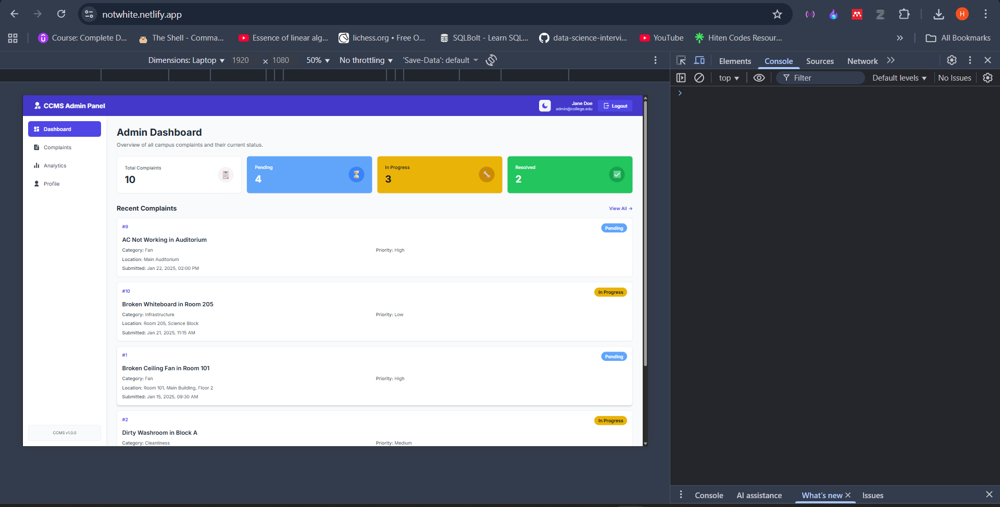
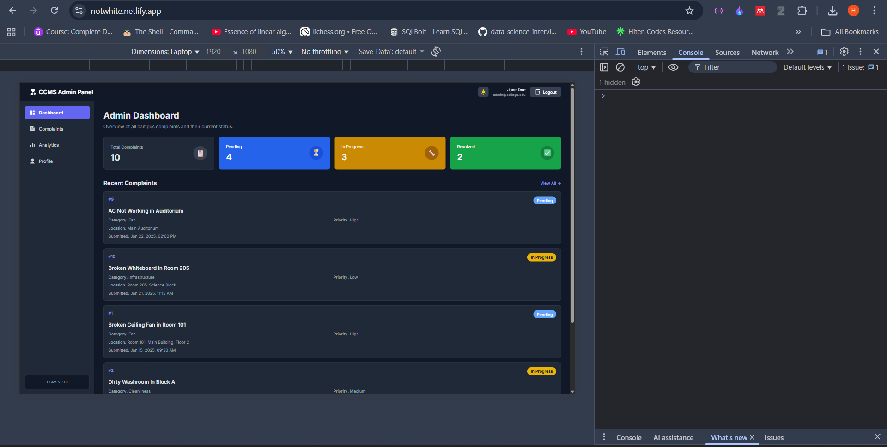
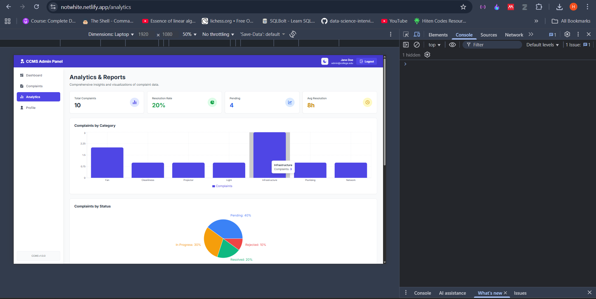
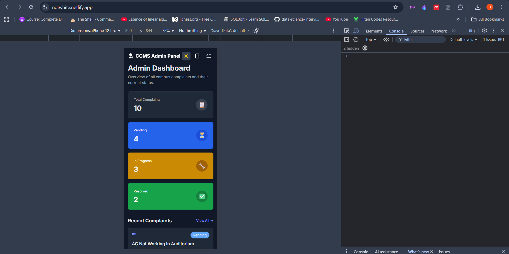
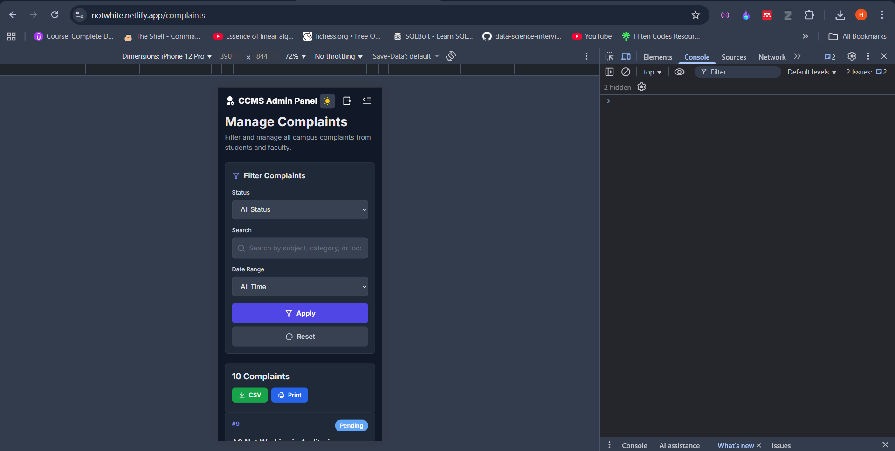

# 🎓 Campus Complaint Management System - Admin Panel

[](https://notwhite.netlify.app)
[](https://reactjs.org/)
[](https://tailwindcss.com/)
[](LICENSE)

A modern, responsive admin dashboard for managing campus facility complaints with real-time analytics, dark mode, anonymous reporting, and PDF verification.

**🔗 Live Demo:** [https://notwhite.netlify.app](https://notwhite.netlify.app)

---

## 📸 Screenshots

<table>
  <tr>
    <td></td>
    <td></td>
  </tr>
  <tr>
    <td align="center"><b>Dashboard (Light Mode)</b></td>
    <td align="center"><b>Dashboard (Dark Mode)</b></td>
  </tr>
  <tr>
    <td></td>
    <td></td>
  </tr>
  <tr>
    <td align="center"><b>Complaint Management</b></td>
    <td align="center"><b>Analytics Dashboard</b></td>
  </tr>
  <tr>
    <td></td>
    <td></td>
  </tr>
  <tr>
    <td align="center"><b>Mobile Dashboard</b></td>
    <td align="center"><b>Mobile Complaints</b></td>
  </tr>
</table>

---

## ✨ Key Features

### 📊 Complaint Management
- **Real-time Dashboard** with live statistics and recent complaint tracking
- **Advanced Filtering** by status, category, priority, and search
- **Status Workflow** - Manage complaint lifecycle (Pending → In Progress → Resolved/Rejected)
- **Detailed View** - Complete complaint information with image gallery and timeline
- **Quick Actions** - Update status, add remarks, and assign tasks

### 🔒 Privacy & Security
- **Anonymous Reporting** - Students can submit complaints without revealing identity
- **Identity Protection** - Contact information hidden for anonymous complaints
- **PDF Verification** - Upload and verify application letters (5MB max, PDF only)
- **Confidentiality Warnings** - Clear indicators for sensitive complaints

### 📈 Analytics & Reporting
- **Interactive Charts** - Category distribution, status overview, priority breakdown, and monthly trends
- **CSV Export** - Download filtered complaint data for offline analysis
- **Print Support** - Print-friendly complaint reports
- **Real-time Statistics** - Auto-updating complaint counts and metrics

### 🎨 User Experience
- **Dark Mode** - Persistent theme toggle with smooth transitions
- **Fully Responsive** - Optimized for mobile, tablet, and desktop
- **Toast Notifications** - Real-time feedback for all actions
- **Loading States** - Skeleton loaders and progress indicators
- **Image Lightbox** - Full-screen image viewer for complaint photos
- **Search Suggestions** - Autocomplete for quick filtering

---

## 🚀 Quick Start

### Prerequisites
- Node.js 16+ and npm

### Installation

```bash
# Clone repository
git clone https://github.com/HarshitPandey-2021/Campus-Complaint-Management-System.git

# Navigate to admin folder
cd Campus-Complaint-Management-System/admin

# Install dependencies
npm install

# Start development server
npm run dev
```

Open [http://localhost:5173](http://localhost:5173) in your browser.

### Build for Production

```bash
npm run build
npm run preview
```

---

## 🛠️ Tech Stack

| Technology | Purpose |
|------------|---------|
| React 18.3.1 | UI Framework |
| Vite 7.x | Build Tool & Dev Server |
| Tailwind CSS 3.4.0 | Styling Framework |
| React Router v6 | Client-side Routing |
| Recharts | Data Visualization |
| React Icons | Icon Library |
| Context API | State Management |

---

## 📁 Project Structure

```
admin/
├── src/
│   ├── components/          # 17 Reusable Components
│   │   ├── Navbar.jsx
│   │   ├── Sidebar.jsx
│   │   ├── ComplaintTable.jsx
│   │   ├── ComplaintDetails.jsx
│   │   ├── ComplaintFilters.jsx
│   │   ├── FileUpload.jsx
│   │   ├── Charts.jsx
│   │   └── ...
│   │
│   ├── pages/               # 5 Main Pages
│   │   ├── Dashboard.jsx
│   │   ├── Complaints.jsx
│   │   ├── Analytics.jsx
│   │   ├── Profile.jsx
│   │   └── NotFound.jsx
│   │
│   ├── services/
│   │   └── adminService.js  # Mock Data (Replace with API)
│   │
│   ├── context/
│   │   └── DarkModeContext.jsx
│   │
│   ├── hooks/
│   │   ├── useToast.js
│   │   └── useCountUp.js
│   │
│   ├── utils/
│   │   └── exportUtils.js
│   │
│   ├── App.jsx
│   └── index.css
│
├── public/
├── package.json
└── vite.config.js
```

---

## 🎯 Feature Highlights

### 1. Anonymous Complaint System 🕵️
Protect student identity for sensitive issues like harassment or ragging with:
- Hidden contact information
- Visual indicators (🕵️ badge)
- Confidentiality warnings for admins
- Optional PDF verification without revealing identity

### 2. PDF Verification System 📄
Verify complaint authenticity with:
- PDF-only upload (5MB max)
- Drag & drop support
- File preview with size and date
- Download capability for admins
- Strict validation (type, size, corruption checks)

### 3. Dashboard Filter Navigation 🎯
Quick filtering with clickable stat cards:
- Click "Total" → View all complaints
- Click "Pending" → Filter pending complaints
- Click "In Progress" → Filter active complaints
- Click "Resolved" → Filter completed complaints

### 4. Responsive Modal System 🎨
Perfectly centered complaint details modal:
- Centers on viewport regardless of scroll position
- Mobile-optimized (90vh max height)
- Scroll lock on background
- ESC key and outside-click to close

### 5. Advanced Analytics 📊
Four interactive chart types:
- Category Distribution (Pie Chart)
- Status Overview (Bar Chart)
- Priority Breakdown (Donut Chart)
- Monthly Trends (Line Chart)

---

## 📊 Mock Data

Currently using **12 sample complaints**:
- **10 Regular Complaints** (visible student information)
- **2 Anonymous Complaints** (protected identity)
- **4 Complaints with PDF** verification documents

**Statistics:**
- Total: 12 complaints
- Pending: 4 | In Progress: 4 | Resolved: 2 | Rejected: 1
- Anonymous: 2 | With PDF: 4

---

## 🌐 Deployment

### Netlify (Current)
```bash
npm run build
# Drag dist/ folder to Netlify dashboard
```

### Vercel
```bash
npm install -g vercel
vercel
```

### GitHub Pages
```bash
npm install --save-dev gh-pages
npm run build
npm run deploy
```

---

## 🎨 Design System

### Colors
- **Pending:** Blue (#60A5FA)
- **In Progress:** Yellow (#F59E0B)
- **Resolved:** Green (#10B981)
- **Rejected:** Red (#DC2626)
- **Primary:** Indigo (#4F46E5)

### Responsive Breakpoints
- **Mobile:** < 768px (Cards, stacked layout)
- **Tablet:** 768px - 1024px (Hybrid layout)
- **Desktop:** ≥ 1024px (Full table view)

### Typography
- **Font:** Inter (Google Fonts)
- **Headings:** Bold, 36px - 20px
- **Body:** Regular, 16px - 12px

---

## 🤝 Contributing

### Workflow
```bash
# Create feature branch
git checkout -b feature/your-feature

# Commit changes
git commit -m "feat: your feature description"

# Push to GitHub
git push origin feature/your-feature

# Create Pull Request
```

### Commit Convention
- `feat:` New feature
- `fix:` Bug fix
- `style:` UI/CSS changes
- `docs:` Documentation
- `refactor:` Code restructuring

---

## 👥 Team

| Role | Name | Status |
|------|------|--------|
| Frontend - Admin Panel | Harshit Pandey | ✅ Complete |
| Frontend - Landing Page | Shakti | 🚧 In Progress |
| Backend API | Somesh | 🚧 In Progress |
| Database & Testing | Shiva | 🚧 In Progress |

---

## 📞 Links

- **Live Demo:** [https://notwhite.netlify.app](https://notwhite.netlify.app)
- **Repository:** [GitHub](https://github.com/HarshitPandey-2021/Campus-Complaint-Management-System)
- **Issues:** [Report Bug](https://github.com/HarshitPandey-2021/Campus-Complaint-Management-System/issues)

---

## 📝 License

This project is licensed under the MIT License - see [LICENSE](LICENSE) file for details.

---

## 📈 Changelog

### v2.0.0 (25th Oct 2025)
- ✅ Added anonymous complaint system with identity protection
- ✅ Added PDF verification document upload
- ✅ Fixed modal positioning on all scroll positions
- ✅ Fixed mobile notification panel overflow
- ✅ Fixed dashboard filter navigation
- ✅ Improved responsive design across all devices

### v1.0.0 (Initial Release)
- ✅ Dashboard with real-time statistics
- ✅ Complaint management with filters
- ✅ Analytics with interactive charts
- ✅ Dark mode support
- ✅ CSV export and print functionality
- ✅ Fully responsive design

---

<div align="center">

**Made with ❤️ by the CCMS Team**

⭐ **Star this repo if you found it helpful!** ⭐

[Live Demo](https://notwhite.netlify.app) • [Report Bug](https://github.com/HarshitPandey-2021/Campus-Complaint-Management-System/issues) • [Request Feature](https://github.com/HarshitPandey-2021/Campus-Complaint-Management-System/issues)

</div>
