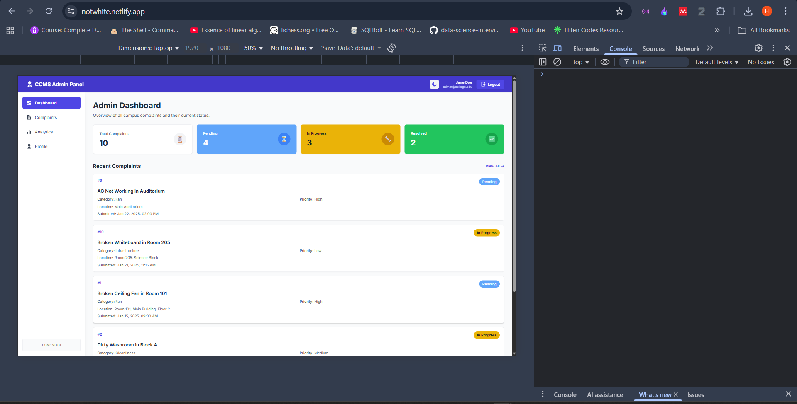
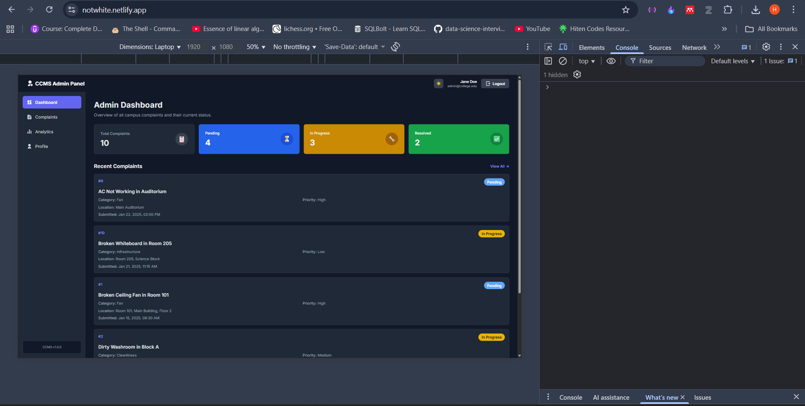

# 🎓 Campus Complaint Management System - Admin Panel

Modern, responsive admin dashboard for managing campus complaints with real-time analytics, dark mode, and export capabilities.


---

## ✨ Features

- **Dashboard** - Real-time statistics with complaint overview and trends
- **Complaint Management** - Filter, search, sort, and update complaint status
- **Analytics** - Interactive charts for insights (category, status, trends)
- **Dark Mode** - Persistent theme toggle with smooth transitions
- **Export & Print** - Download CSV reports or print complaint lists
- **Fully Responsive** - Optimized for mobile, tablet, and desktop devices

---

## 🚀 Quick Start

```bash
# Install dependencies
npm install

# Run development server
npm run dev

# Open browser at http://localhost:5173
```

**Build for production:**
```bash
npm run build
```

---

## 🛠️ Tech Stack

| Technology | Purpose |
|------------|---------|
| React 18 + Vite | Frontend framework & build tool |
| Tailwind CSS | Utility-first styling |
| React Router v6 | Client-side routing |
| Recharts | Data visualization |
| React Icons | Icon library |
| Context API | State management (dark mode) |

---

## 📁 Project Structure

```
admin/
├── src/
│   ├── components/          # Reusable UI components
│   │   ├── Navbar.jsx       # Top navigation with dark mode
│   │   ├── Sidebar.jsx      # Left navigation menu
│   │   ├── ComplaintTable.jsx    # Table (desktop) + Cards (mobile)
│   │   ├── ComplaintFilters.jsx  # Search & filter controls
│   │   ├── ComplaintDetails.jsx  # Modal for complaint details
│   │   ├── Charts.jsx            # Analytics charts
│   │   ├── Toast.jsx             # Notification system
│   │   └── ...
│   │
│   ├── pages/               # Route pages
│   │   ├── Dashboard.jsx    # Overview with stats
│   │   ├── Complaints.jsx   # Complaint management
│   │   ├── Analytics.jsx    # Charts & insights
│   │   └── Profile.jsx      # Admin profile
│   │
│   ├── services/            # Data & API layer
│   │   └── adminService.js  # ⚠️ Currently mock data - Replace with API
│   │
│   ├── context/             # React Context
│   │   └── DarkModeContext.jsx
│   │
│   ├── hooks/               # Custom hooks
│   │   └── useToast.js
│   │
│   ├── utils/               # Helper functions
│   │   └── exportUtils.js   # CSV export & print
│   │
│   └── App.jsx              # Main app with routing
│
├── docs/                    # Documentation & screenshots
├── package.json
└── README.md
```

---

## 🔌 Backend Integration

### Current State
All data is **mock data** from `src/services/adminService.js`. Replace with real API calls.

### Required API Endpoints

#### Authentication
```
POST   /api/auth/login        # Admin login
GET    /api/auth/profile      # Get admin profile
PATCH  /api/auth/profile      # Update profile
```

#### Complaints
```
GET    /api/complaints                 # Get all complaints
GET    /api/complaints/:id             # Get single complaint
PATCH  /api/complaints/:id/status      # Update status
GET    /api/complaints/stats           # Get statistics
GET    /api/complaints/analytics       # Get chart data
```

### Expected Data Format

**Complaint Object:**
```json
{
  "id": 1,
  "subject": "Broken Ceiling Fan in Room 101",
  "category": "Fan",
  "location": "Room 101, Main Building",
  "status": "Pending",
  "priority": "High",
  "submittedBy": "Student Name",
  "email": "student@college.edu",
  "submittedAt": "2025-01-15T09:30:00Z",
  "description": "Detailed description...",
  "adminRemarks": "",
  "updatedAt": "2025-01-15T09:30:00Z"
}
```

**Status Values:** `Pending`, `In Progress`, `Resolved`, `Rejected`  
**Priority Values:** `High`, `Medium`, `Low`  
**Categories:** `Fan`, `Light`, `Cleanliness`, `Projector`, `Infrastructure`, `Plumbing`, `Network`

### Integration Steps

1. **Create API service** (`src/services/api.js`):
```javascript
const API_URL = 'http://localhost:3000/api';

export const complaintAPI = {
  getAll: async () => {
    const token = localStorage.getItem('token');
    const res = await fetch(`${API_URL}/complaints`, {
      headers: { 'Authorization': `Bearer ${token}` }
    });
    return res.json();
  }
};
```

2. **Replace mock imports** in components:
```javascript
// OLD: import { getAllComplaints } from '../services/adminService';
// NEW: import { complaintAPI } from '../services/api';
```

3. **Handle errors** with try-catch and show toast notifications

---

## 💾 Database Schema

### Users Table (Admins)
```sql
id, name, email, password_hash, role, department, created_at
```

### Complaints Table
```sql
id, subject, description, category, location, status, priority,
submitted_by, email, submitted_at, admin_remarks, assigned_to, updated_at
```

---

## 🎨 Design System

**Colors:**
- Pending: Blue (#3B82F6)
- In Progress: Yellow (#F59E0B)  
- Resolved: Green (#10B981)
- Rejected: Red (#DC2626)
- Primary: Indigo (#4F46E5)

**Responsive Breakpoints:**
- Mobile: < 768px
- Tablet: 768px - 1024px
- Desktop: ≥ 1024px

**Typography:** Inter font (Google Fonts)

---

## 🌐 Deployment

### Vercel (Recommended)
```bash
npm install -g vercel
vercel
```

### Netlify
```bash
npm run build
npx netlify-cli deploy --prod --dir=dist
```

### GitHub Pages
```bash
npm install --save-dev gh-pages

# Add to package.json:
"homepage": "https://username.github.io/repo-name",
"scripts": { "deploy": "gh-pages -d dist" }

npm run build && npm run deploy
```

---

## 📸 Screenshots

### Desktop


### Dark Mode



### Mobile


---

## 🤝 Contributing

**Branch Structure:**
- `main` - Production code
- `develop` - Development branch
- `feature/*` - Feature branches

**Workflow:**
```bash
git checkout -b feature/your-feature
git add .
git commit -m "feat: description"
git push origin feature/your-feature
# Create Pull Request on GitHub
```

**Commit Format:**
- `feat:` New feature
- `fix:` Bug fix
- `style:` UI changes
- `docs:` Documentation

---

## 👥 Team

- **Frontend (Admin):** Harshit
- **Frontend (Landing_Page):** Shakti 
- **Backend:** Somesh
- **Database:** Shiva

---

## 📞 Support

**Live Demo:** [View Here](https://notwhite.netlify.app)  
**Issues:** Open GitHub issue  
**Contact:** team@college.edu 

---